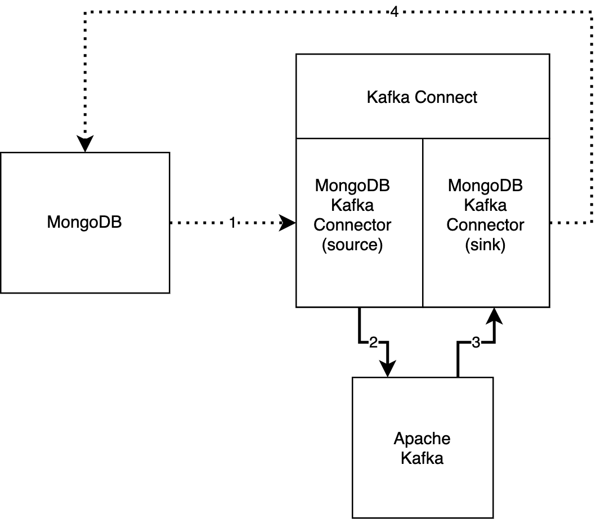

# Quick Start

This is the MongoDB Kafka Connector quick start. The quick start contains a docker
environment with the following services:

- MongoDB single node replica set
- Kafka Connect
- Apache Kafka
- Zookeeper (Dependency of Apache Kafka)

The docker environment contains a sample pipeline. The following diagram shows the architecture of
the sample pipeline. The solid lines represent connections between tools that you receive
pre-configured. The dotted lines represent connections you will add in the following sections of
this guide. The numbers, from lowest to highest, show the path of a message through the pipeline:

## Usage

Perform the following actions to install MongoDB Kafka Connector source and sink connectors and send a document through Apache Kafka:

1. Start the docker environment by running the following command:

       docker-compose -p quickstart up -d

2. Enter the a shell in the docker environment with the following command:

       docker exec -it shell /bin/bash

3. Install connectors by running the following commands:

       curl -X POST \
            -H "Content-Type: application/json" \
            --data '
            {"name": "mongo-source",
             "config": {
                "connector.class":"com.mongodb.kafka.connect.MongoSourceConnector",
                "connection.uri":"mongodb://mongo1:27017/?replicaSet=rs0",
                "database":"quickstart",
                "collection":"source",
                "pipeline":"[{\"$match\": {\"operationType\": \"insert\"}}, {$addFields : {\"fullDocument.travel\":\"I went through Kafka!\"}}]"
                }
            }
            ' \
            http://connect:8083/connectors -w "\n"
       
       curl -X POST \
            -H "Content-Type: application/json" \
            --data '
            {"name": "mongo-sink",
             "config": {
                "connector.class":"com.mongodb.kafka.connect.MongoSinkConnector",
                "connection.uri":"mongodb://mongo1:27017/?replicaSet=rs0",
                "database":"quickstart",
                "collection":"sink",
                "topics":"quickstart.source",
                "change.data.capture.handler": "com.mongodb.kafka.connect.sink.cdc.mongodb.ChangeStreamHandler"
                }
            }
            ' \
            http://connect:8083/connectors -w "\n"

4. Enter the MongoDB shell with the following command:

       mongosh mongodb://mongo1:27017/?replicaSet=rs0

5. Upload a document to the `source` collection in the `quickstart` database:

       use quickstart
       db.source.insertOne({"hello":"kafka"})

6. Wait 5-10 seconds and run the following command:

    db.sink.find()

   You should see a document resembling the following:

   `{"_id":{"$oid":"<your id value>"},"hello": "kafka"}`

To stop the process, exit the docker environment and run the following command:
    
    docker-compose down -v

## Documentation

For more information on the quick start pipeline, see the
[MongoDB Kafka Connector Documentation](https://docs.mongodb.com/kafka-connector/current/quickstart).
